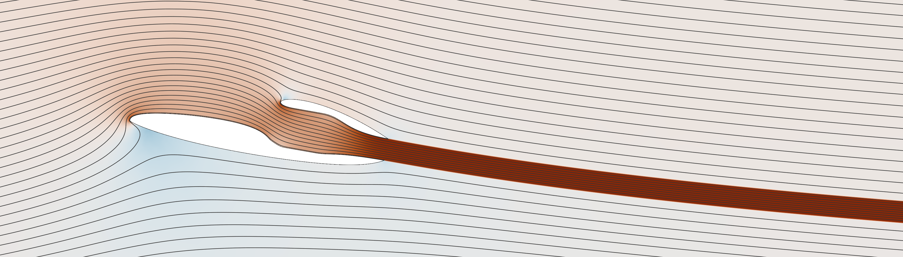

## `APPAC2D: Potential flow-based solver for airfoils with jet flow in MATLAB`
Authors: Himavath Jois, Alan S. Hong, Phillip J. Ansell

Inquiries: hjois2@illinois.edu

`APPAC2D` (**A**ero**P**ropulsive **PA**nel **C**ode in Two Dimensions) is a `MATLAB` / `OCTAVE`-based panel method that solves the linear small-disturbance Prandtl-Glauert equation for subsonic flow for single or multielement airfoil systems with or without an interacting jet flow.

  

This code calculates the performance of an aero-propulsive airfoil system by modeling the propulsive actuator as a set of powered wake boundaries emanating from the trailing edge of two airfoil surfaces. The details of the implementation are found in the comments of the code as well as in reference `[1]`.

### `Changelog`
* v2.1.0 (February 22nd, 2025) - added suite of data visualization tools including contour plotting and streamlines on unstructured triangular grids
* v2.0.0 (February 20th, 2025) - brought over all optimizations and features from parallel branch with full support for GNU Octave
* v1.0.1 (May 10th, 2024) - suite of changes made to boost performance and increase compatibility with GNU Octave
* v1.0.0 (January 20th, 2024) - initial public release

### `Instructions`
A user should first download all files and begin working in `designDriver.m`. The following inputs are required to begin an analysis:
1. Airfoil coordinates - at least two sets of airfoil coordinates are required for the code to run properly, since a powered wake must be bounded from both top and bottom. Beyond that, you can have as many surfaces as your computer can handle. Airfoil coordinates must be simply connected polylines starting and ending at a sharp trailing edge, although the orientation of the loop (CW/CCW) does not matter. Example coordinates are given in the "Airfoils" folder.
2. System angle of attack (AoA, alpha, $\alpha$)
3. Propulsion thrust coefficient (CT, $C_T=\Delta H/(\rho V_\infty^2)$)

Once the three inputs are provided in `designDriver.m`, users should run the first section of code to complete the analysis. Typical configurations, such as the ones given in the examples, should converge within 10-15 iterations (`iter`). A user may then choose to plot the velocity field and streamlines by running the second section, and/or pressure distributions from the third section. Further discussion about what the code is doing can be found in the comments and the aforementioned paper. 

Additional contents related to the `/mesh2d` and `/colormaps` folders provide easy access data visualization tools. In particular, velocity fields are created on unstructured triangular grids generated by "provably-good" algorithms in `MESH2D` while streamlines are drawn directly from these unstructured data (no data loss from grid interpolation). The authors highly recommend plotting contour data using the included scientific colormaps curated by Fabio Crameri.

### `Disclaimers`
This code is considered feature complete. There are currently no plans to develop this code further, though feedback would be greatly appreciated, particularly on the scientific aspects of the implementation. Feedback and/or requests for bug fixes and/or feature additions can be made to the email address at the top of this file, but the authors make no guarantee of these services. If available, future code versions will be posted to the research group website: https://ansell.aerospace.illinois.edu/. 

### `License`
Published and distributed under the MIT Open License (LICENSE.txt).

Copyright &copy; 2024 Himavath Jois, Alan S. Hong, Phillip J. Ansell.

Permission is hereby granted, free of charge, to any person obtaining a copy of this software and associated documentation files (the "Software"), to deal in the Software without restriction, including without limitation the rights to use, copy, modify, merge, publish, distribute, sublicense, and/or sell copies of the Software, and to permit persons to whom the Software is furnished to do so, subject to the following conditions:

The above copyright notice and this permission notice shall be included in all copies or substantial portions of the Software.

THE SOFTWARE IS PROVIDED "AS IS", WITHOUT WARRANTY OF ANY KIND, EXPRESS OR IMPLIED, INCLUDING BUT NOT LIMITED TO THE WARRANTIES OF MERCHANTABILITY, FITNESS FOR A PARTICULAR PURPOSE AND NONINFRINGEMENT. IN NO EVENT SHALL THE AUTHORS OR COPYRIGHT HOLDERS BE LIABLE FOR ANY CLAIM, DAMAGES OR OTHER LIABILITY, WHETHER IN AN ACTION OF CONTRACT, TORT OR OTHERWISE, ARISING FROM, OUT OF OR IN CONNECTION WITH THE SOFTWARE OR THE USE OR OTHER DEALINGS IN THE SOFTWARE.

### `References`
`[1]` - H. Jois and P. J. Ansell, <a href="https://doi.org/10.2514/6.2023-1754">Analytical Framework for Design of Aero-Propulsive Geometries with Powered Wakes</a>, AIAA 2023-1754. *AIAA SCITECH 2023 Forum*. January 2023.

`[2]` - C. A. Shollenberger, <a href="https://doi.org/10.2514/3.60225">Analysis of the Interaction of Jets and Airfoils in Two Dimensions</a>, *Journal of Aircraft*, Vol. 10, No. 5, 1973, pp. 267–273.

`[3]` - C. A. Shollenberger, <a href="https://doi.org/10.7907/GZNT-1X61">An Investigation of a Two-Dimensional Propulsive Lifting System</a>, Ph.D. Thesis, California Institute of Technology, 1971.

`[4]` - Darren Engwirda, <a href="http://hdl.handle.net/2123/13148">Locally-optimal Delaunay-refinement and optimisation-based mesh generation</a>, Ph.D. Thesis, School of Mathematics and Statistics, The University of Sydney, September 2014.

`[5]` - Darren Engwirda, Unstructured mesh methods for the Navier-Stokes equations, Honours Thesis, School of Aerospace, Mechanical and Mechatronic Engineering, The University of Sydney, November 2005.